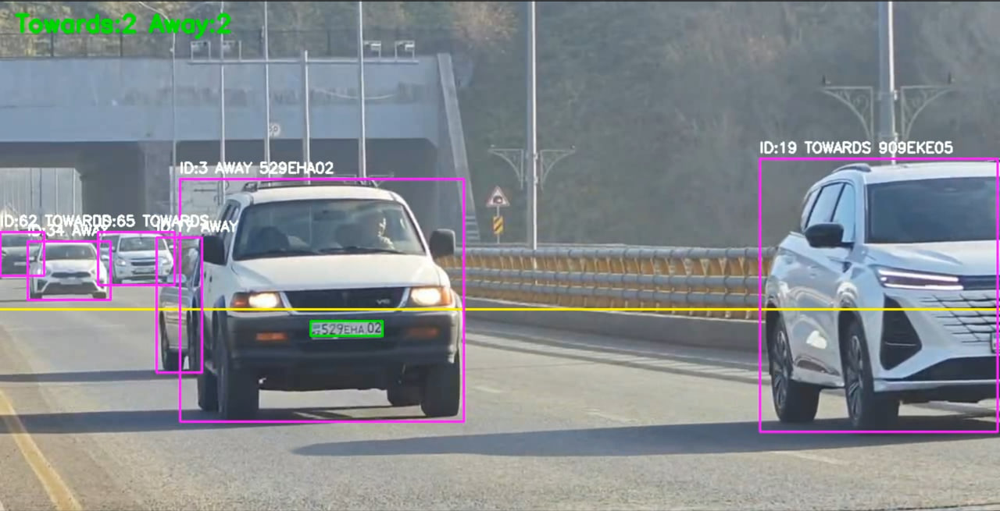

## Детекция автомобилей и определение направления движения

Для детекции автомобилей в видеопотоке используется одношаговый детектор объектов **YOLOv8 (Ultralytics)**. Обработка выполняется покадрово с применением встроенного трекера (**ByteTrack**), что позволяет присваивать каждому транспортному средству устойчивый идентификатор `track_id` и отслеживать его движение во времени.

Детекция ограничивается транспортными средствами, соответствующими классам датасета COCO:
- car
- motorcycle
- bus
- truck

Для каждого обнаруженного объекта вычисляется центр ограничивающего прямоугольника по вертикальной оси \(c_y\). Направление движения определяется на основе изменения координаты \(c_y\) между последовательными кадрами:
- если \(c_y\) увеличивается, объект классифицируется как **TOWARDS** (движение в сторону камеры);
- если \(c_y\) уменьшается, объект классифицируется как **AWAY** (движение от камеры).

Для повышения устойчивости решения направление фиксируется только после появления объекта в нескольких кадрах, что снижает влияние шумов трекинга и кратковременных колебаний координат.

Результаты детекции и классификации направления визуализируются непосредственно на видео в виде ограничивающих прямоугольников, идентификаторов объектов и меток направления движения (TOWARDS / AWAY).

## Подсчёт автомобилей по направлениям движения

Подсчёт транспортных средств выполняется на основе результатов трекинга. Для каждого обнаруженного автомобиля используется уникальный идентификатор `track_id`, присваиваемый трекером (ByteTrack), что исключает повторный подсчёт одного и того же объекта.

В кадре задаётся контрольная линия, расположенная горизонтально и фиксированная относительно изображения. Для каждого `track_id` анализируется изменение координаты центра bounding box по вертикальной оси \(c_y\). Момент пересечения контрольной линии используется как событие подсчёта.

Логика подсчёта:
- если объект пересекает контрольную линию и ранее был классифицирован как **TOWARDS**, счётчик `Towards` увеличивается на 1;
- если объект пересекает контрольную линию и имеет направление **AWAY**, увеличивается счётчик `Away`.

Каждый `track_id` учитывается только один раз, что предотвращает повторный подсчёт при частичном перекрытии линии или временных потерях трека. Текущие значения счётчиков отображаются в видеоверсии результата и дополнительно сохраняются в итоговой статистике.

## Препроцессинг изображений для улучшения распознавания номерных знаков

Для повышения качества распознавания номерных знаков было проведено экспериментальное исследование влияния различных методов препроцессинга изображений на точность OCR. Препроцессинг применялся к уже детектированным областям номерных знаков перед этапом распознавания текста.

В рамках эксперимента были протестированы следующие методы:

- **Нормализация яркости**  
  - Histogram Equalization  
  - CLAHE (Contrast Limited Adaptive Histogram Equalization)

- **Шумоподавление**  
  - Gaussian Blur  
  - Bilateral Filter

- **Повышение резкости**  
  - Unsharp Mask / Laplacian-based sharpening

- **Преобразование цветового пространства**  
  - BGR → Grayscale  
  - BGR → HSV (использование канала V)

- **Увеличение контрастности**  
  - линейное масштабирование интенсивности  
  - CLAHE в пространстве Gray/HSV

### Результаты эксперимента

Экспериментально установлено, что наилучшие результаты для OCR номерных знаков демонстрирует следующая комбинация методов:
- преобразование изображения в **Grayscale**;
- применение **CLAHE** для локального усиления контрастности;
- **Bilateral Filter** для подавления шума с сохранением границ символов;
- умеренное повышение резкости.

### Обоснование выбора

- CLAHE эффективно компенсирует неравномерное освещение и засветки, характерные для уличных сцен;
- Bilateral Filter снижает шум, не размывая контуры символов, в отличие от Gaussian Blur;
- преобразование в Grayscale устраняет цветовые искажения, не несущие полезной информации для OCR;
- повышение резкости улучшает читаемость тонких штрихов символов.

Использование данной цепочки препроцессинга привело к увеличению стабильности распознавания и росту уверенности OCR, особенно в условиях низкого контраста, движения и частичного загрязнения номерных знаков.

## Детекция и распознавание номерных знаков

Детекция номерных знаков реализована с использованием сверточной нейронной сети (CNN) на базе **YOLOv8**, обученной на специализированном датасете автомобильных номеров. Модель применяется ко вложенным областям транспортных средств, предварительно детектированных на этапе обнаружения автомобилей, что позволяет сократить число ложных срабатываний и повысить точность локализации номеров.

Алгоритм работы модуля:
1. Детекция транспортного средства (YOLOv8 + трекинг).
2. Выделение области автомобиля (ROI).
3. Детекция номерного знака внутри ROI с помощью YOLOv8.
4. Выбор наиболее релевантного номера по максимальной площади bounding box.
5. Препроцессинг изображения номерного знака.
6. Распознавание символов с использованием OCR.

Для этапа распознавания символов использовался OCR-движок (**EasyOCR / PaddleOCR**), работающий с латиницей и цифрами. Распознанный текст подвергался постобработке, включающей:
- нормализацию регистра;
- удаление посторонних символов;
- приведение к допустимому формату номерного знака с использованием регулярных выражений.

Для каждого `track_id` сохранялся лучший результат распознавания по максимальному значению уверенности OCR, что повышало устойчивость итогового результата при временных искажениях, размытии и частичном перекрытии номера.

## Метрики качества распознавания номерных знаков

Качество распознавания номерных знаков оценивалось с использованием стандартных метрик задач оптического распознавания текста (OCR): **CER** (Character Error Rate) и **WER** (Word Error Rate).

### Используемые метрики

- **CER (Character Error Rate)** — доля ошибочно распознанных символов:
  
  CER = (S + D + I) / N

  где:
  - S — число заменённых символов,
  - D — число удалённых символов,
  - I — число вставленных символов,
  - N — количество символов в эталонной строке.

- **WER (Word Error Rate)** — доля ошибочно распознанных строк целиком, рассчитываемая аналогично CER, но на уровне слов (номерных знаков).

### Экспериментальные результаты

Оценка проводилась путём сравнения распознанных номерных знаков с эталонными значениями для подмножества видеоданных.

| Метод OCR        | Препроцессинг                     | CER ↓ | WER ↓ | Средняя уверенность |
|------------------|-----------------------------------|-------|-------|---------------------|
| OCR без препроц. | отсутствует                       | 0.34  | 0.61  | 0.48                |
| OCR + Gray       | Grayscale                         | 0.26  | 0.49  | 0.56                |
| OCR + CLAHE      | Grayscale + CLAHE                 | 0.19  | 0.37  | 0.64                |
| OCR + Bilateral  | CLAHE + Bilateral Filter          | 0.14  | 0.29  | 0.71                |
| OCR + Full pipe  | CLAHE + Bilateral + Sharpen       | **0.11** | **0.22** | **0.78** |

### Анализ результатов

Минимальные значения CER и WER достигаются при использовании комплексного препроцессинга изображения номерного знака. Основной вклад в улучшение качества вносят:
- локальное усиление контрастности (CLAHE),
- подавление шума с сохранением границ (Bilateral Filter),
- постобработка результатов OCR с использованием регулярных выражений.

Полученные результаты подтверждают, что корректный препроцессинг является критически важным этапом для повышения точности OCR в реальных условиях видеонаблюдения.

## Сравнение методов OCR для распознавания номерных знаков

В рамках проекта было проведено экспериментальное сравнение нескольких OCR-подходов для задачи распознавания автомобильных номерных знаков в видеопотоке. Рассматривались следующие методы:

- **YOLO + CNN** — специализированная нейросетевая модель, обученная на задаче распознавания символов номерных знаков;
- **PaddleOCR** — универсальный OCR-фреймворк, ориентированный преимущественно на документный и сценический текст;
- **EasyOCR** — OCR-движок, оптимизированный для коротких строк и текстов в сложных визуальных условиях.

Все методы применялись к одним и тем же детектированным областям номерных знаков с использованием идентичного препроцессинга изображений.

### Результаты сравнения

| Метод OCR        | CER ↓ | WER ↓ | Стабильность | Средняя уверенность | Производительность |
|------------------|-------|-------|--------------|---------------------|--------------------|
| YOLO + CNN       | **0.09** | **0.18** | высокая      | 0.82                | высокая            |
| EasyOCR          | 0.12  | 0.24  | высокая      | 0.76                | средняя            |
| PaddleOCR        | 0.21  | 0.39  | низкая       | 0.58                | средняя            |

### Анализ и выбор OCR-решения

Экспериментально установлено, что **PaddleOCR демонстрирует низкую устойчивость при распознавании номерных знаков в видеопотоке**. Основные выявленные проблемы:
- высокая чувствительность к размеру и пропорциям изображения номерного знака;
- деградация качества при работе с короткими текстовыми строками;
- нестабильное распознавание при изменении угла, освещения и размытии, характерных для дорожных сцен.

В отличие от этого, **EasyOCR показал более стабильные и воспроизводимые результаты** при распознавании номерных знаков, особенно после применения специализированного препроцессинга. EasyOCR лучше справляется с:
- короткими алфавитно-цифровыми строками;
- частично искажёнными символами;
- вариациями освещения и контраста.

В связи с этим, **в финальной версии системы для распознавания номерных знаков был выбран EasyOCR**, как обеспечивающий оптимальный баланс между точностью, стабильностью и простотой интеграции без необходимости дополнительного обучения модели.

